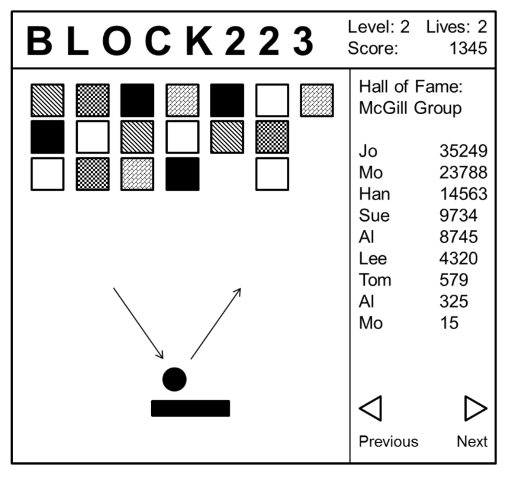

# ECSE 223: Model Based Programming

## Project:
A user has a unique user name. A user is always a player and optionally an admin. A user has different passwords as a player and as an admin. Only an admin may create a game in the Block223 application. Each game has a unique name (e.g., McGill Group as shown in the figure below) and its own hall of fame. The admin designs a game by defining a set of blocks. Each block has a color and is worth a certain number of points between 1 and 1000 as specified by the admin. A game has several levels as defined by the admin. Levels are numbered starting with Level 1 and the maximum number of levels is 99. For each level, the admin specifies the starting arrangement of blocks. Each block is placed in one cell of a grid system. The block at the top left corner is in grid position 1/1, the one to the right of it is in grid position 2/1, the one below it is in grid position 1/2, and so on. The admin may also define a level as random, i.e., the blocks at the top are randomly selected for the level from the set of blocks defined by the admin. The number of blocks shown at the beginning of each level is the same and is also defined by the admin. With each level, the speed of the ball increases starting at its minimum speed and the length of the paddle is reduced gradually from its maximum length to its minimum length. The minimum speed, speed increase factor, maximum length, and minimum length are all specified by the admin for the game. The side of the square blocks, the diameter of the ball, and the width of the paddle are the same for all games: 20, 10, and 5, respectively. The size of the play area, on the other hand, is specified by the admin but has to be between 200x200 and 500x500.

